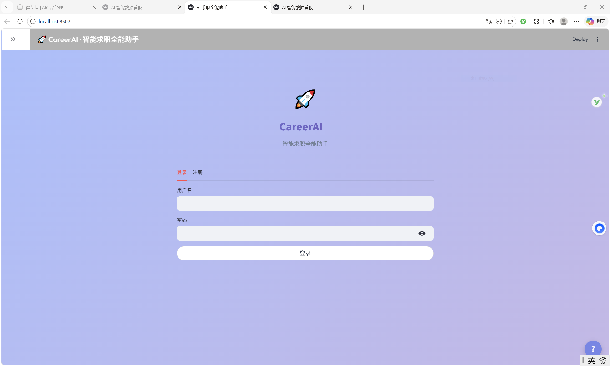
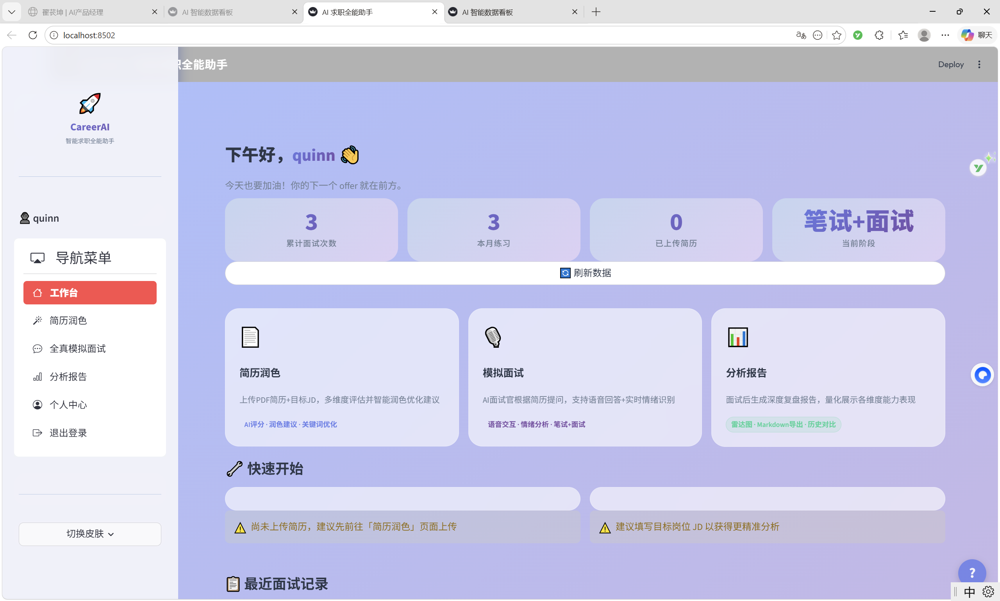

# 翟苌坤 - AI产品经理作品集

## 文件结构

```
portfolio/
├── index.html      # 主页面
├── style.css       # 样式文件
├── resume.pdf      # 简历下载
└── README.md       # 部署说明
```

## 快速预览

直接在浏览器中打开 `index.html` 文件即可预览网站效果。

## 部署到 Vercel（推荐）

### 方法一：通过 Vercel 网页端

1. 访问 [vercel.com](https://vercel.com)，使用 GitHub 账号登录
2. 点击 "New Project"
3. 选择 "Import Git Repository"
4. 先将 `portfolio` 文件夹上传到你的 GitHub 仓库
5. 选择该仓库，点击 "Deploy"
6. 等待部署完成，获得免费域名（如：your-name.vercel.app）

### 方法二：通过 Vercel CLI

```bash
# 安装 Vercel CLI
npm install -g vercel

# 进入 portfolio 目录
cd portfolio

# 登录并部署
vercel

# 按提示操作，完成后会获得一个 .vercel.app 域名
```

## 部署到 GitHub Pages

1. 创建 GitHub 仓库（如：`your-name.github.io`）
2. 将 `portfolio` 文件夹内容上传到仓库
3. 进入仓库 Settings → Pages
4. Source 选择 "Deploy from a branch"
5. 选择 main 分支，点击 Save
6. 等待几分钟后，访问 `https://your-name.github.io`

## 后续优化建议

### 1. 添加项目截图
在 `index.html` 中找到 `<div class="screenshots-placeholder">` 部分，替换为：
```html
<div class="screenshots-grid">
    
    
</div>
```

### 2. 部署 Demo 链接
建议将 CareerAI 和 Med-RAG 部署到：
- **Hugging Face Spaces**（适合 Gradio 项目）
- **Streamlit Cloud**（适合 Streamlit 项目）
- **Vercel**（适合 Web 项目）

### 3. 自定义域名（可选）
- 购买域名后，在 Vercel 设置中添加自定义域名
- 建议使用：`yourname.ai` 或 `yourname.dev`

## 联系方式更新

如需修改联系方式，编辑 `index.html` 中对应部分：
- 邮箱：quinn_work@outlook.com
- 电话：13262104206
- GitHub：https://github.com/EchorKr

---